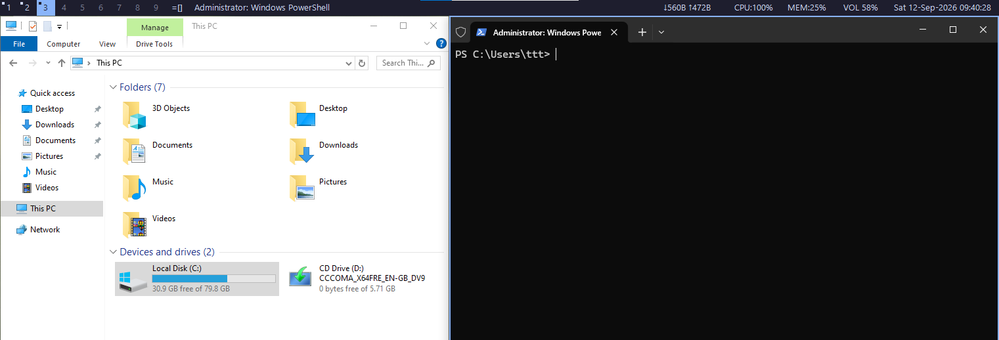

# Wtile

A dynamic tiling window manager for Windows.

Wtile brings dynamic tiling, tags, and a keyboard-driven workflow — the model popularized by
[dwm](https://dwm.suckless.org/) on X11 and proven viable on Win32 by [bug.n](https://github.com/fuhsjr00/bug.n)
— to Windows 10/11. It's written in C# on .NET with NativeAOT (a real native `.exe`, no runtime to
install, no JIT warmup), built for environments where switching operating systems isn't an option.



## Status

Actively developed, not yet a 1.0. Expect rough edges. Issues and PRs welcome.

## Features

- **Dynamic tiling** with multiple layouts: master-stack (dwm's classic `[]=`, master column
  either side), monocle (`[M]`, one fullscreen window at a time), centered-master (`|M|`,
  centered single window), and vertical-stack (`=`, full-width rows).
- **Tags, not virtual desktops** — dwm-style: each window belongs to a tag, tags are switched
  instantly, and each tag remembers its own layout, master count (`nmaster`), master/stack ratio
  (`mfact`), and gap independently.
- **Multi-monitor**, dwm-style: each monitor gets its own tags and layout state off one shared
  config, with `focus-monitor`/`move-window-to-monitor` to move between them.
- **Status bar** per monitor: tags (with an occupancy indicator), current layout symbol, focused
  window title, clock — GDI+ rendered, click-to-switch-tag.
- **Global hotkeys** via a low-level keyboard hook, not `RegisterHotKey` — because Windows reserves
  most of the `Win+<key>` space for the shell, this actually works for bare `Win+letter` bindings
  the way dwm/bug.n users expect.
- **bug.n-style window pinning** (stay visible across every tag switch) and dwm-style "view all
  tags" (`view(~0)`).
- **Fully configurable via YAML**, hot-reloadable with a single hotkey (no background file
  watcher — you press reload after editing, or after changing monitor setup).
- Optional **taskbar hiding** and **title-bar/border stripping** per window, for a cleaner,
  fully tiled look.

## Download

Grab the latest build from [Releases](../../releases) — a self-contained `win-x64` executable,
no .NET runtime install required.

## Configuration

On first run, Wtile writes a commented default config to `%APPDATA%\Wtile\config.yaml`. See
[`docs/config.sample.yaml`](docs/config.sample.yaml) for the canonical, fully-documented example,
including a mapping of every binding back to its dwm/bug.n equivalent. After editing, press the
reload hotkey (`Win+Shift+R` by default) to apply changes — nothing is watched automatically.

## Building from source

Requires the .NET 10 SDK and the "Desktop development with C++" Visual Studio workload (needed by
NativeAOT's linker).

```powershell
dotnet build Wtile.slnx -c Release
dotnet test tests/Wtile.Tests/Wtile.Tests.csproj -c Release
dotnet publish src/Wtile/Wtile.csproj -c Release -r win-x64 --self-contained
```

The published executable lands in `src/Wtile/bin/Release/net10.0-windows/win-x64/publish/`.

## Acknowledgments

Wtile wouldn't exist without these projects:

- [dwm](https://dwm.suckless.org/) (MIT/X Consortium License) — the layout model, tag concept, and overall philosophy.
- [bug.n](https://github.com/fuhsjr00/bug.n) (GPLv3) — proof this works on Win32, and the source of several features (pinning, taskbar hiding) that don't have a dwm equivalent.
- [MangoWM](https://github.com/mangowm/mango) — additional inspiration.

## License

[MIT](LICENSE)
